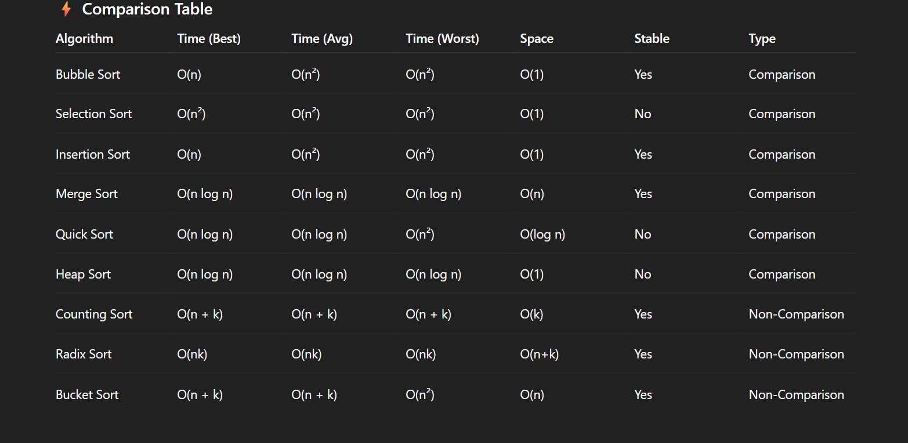

# Sorting Algorithms

## Comparison Table

The following table provides a comprehensive comparison of various sorting algorithms, including their time complexities, space complexity, stability, and type:

This comparison table shows the performance characteristics of different sorting algorithms:

- **Time Complexity**: Best, average, and worst-case scenarios
- **Space Complexity**: Additional memory requirements
- **Stable**: Whether the algorithm maintains the relative order of equal elements
- **Type**: Classification as comparison-based or non-comparison based algorithms

## Key Insights

From the comparison table above:

### Comparison-Based Algorithms
- **Bubble Sort, Selection Sort, Insertion Sort**: Simple O(n²) algorithms, suitable for small datasets
- **Merge Sort**: Consistent O(n log n) performance with guaranteed stability
- **Quick Sort**: Average O(n log n) but can degrade to O(n²) in worst case
- **Heap Sort**: Guaranteed O(n log n) with O(1) space complexity

### Non-Comparison Based Algorithms
- **Counting Sort, Radix Sort, Bucket Sort**: Can achieve linear time complexity under specific conditions
- Particularly effective when the range of input values is limited or known

Each algorithm has its own strengths and is suitable for different scenarios depending on the data characteristics and performance requirements.